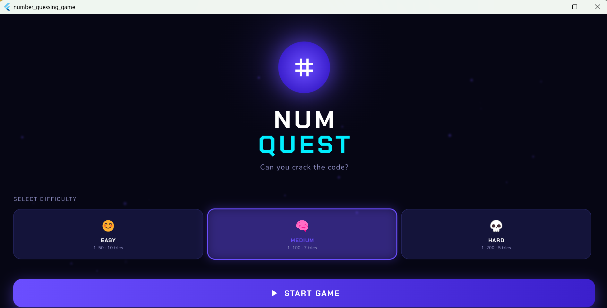
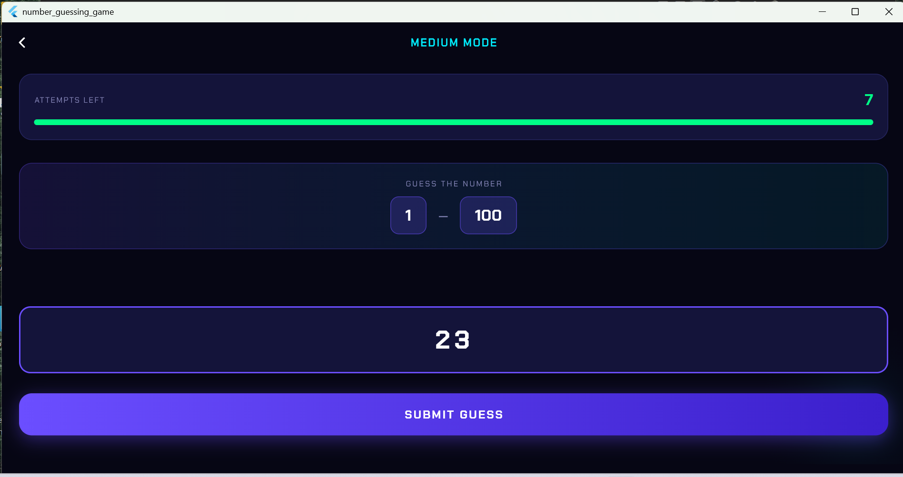
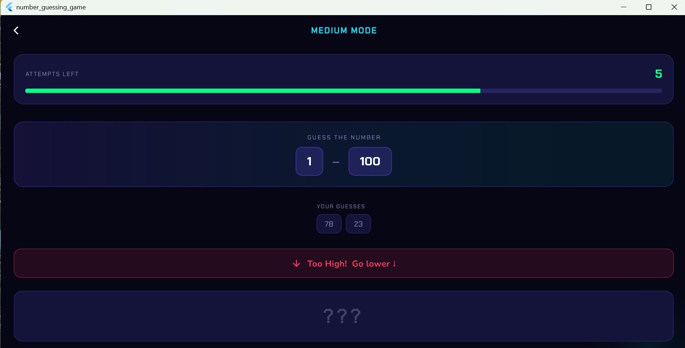
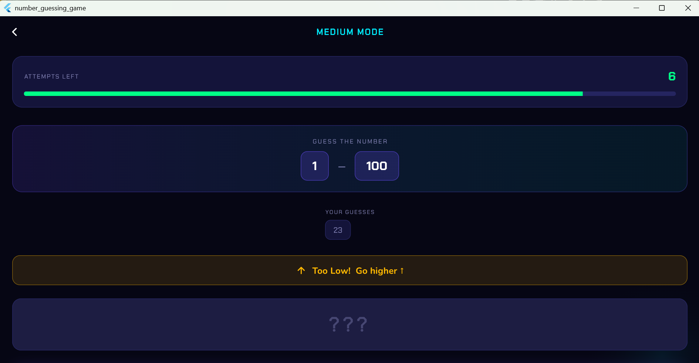
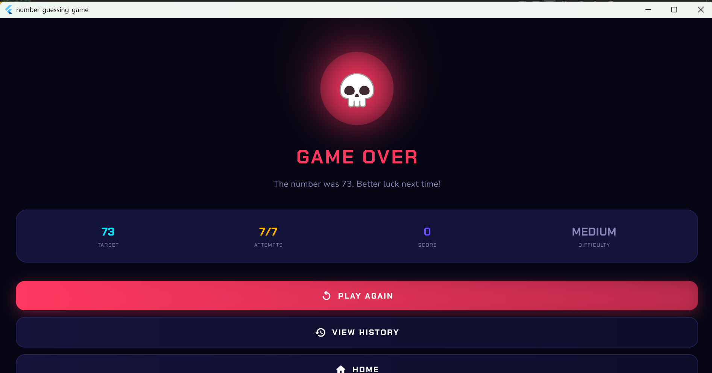

# 🎯 NumQuest — Number Guessing Game
Developed By: Ruman Gull- A Flutter Developer

<p align="center">
  
  
  
  
</p>

<p align="center">
  A polished, production-grade number guessing game built with Flutter.<br/>
  Features a dark cyberpunk UI, three difficulty levels, a smart scoring system, and full SQLite game history.
</p>

---

## 📱 Screenshots

| Home Screen | Game Screen | Hint Feedback | Remaining Attempts | Game Over | 
|:-----------:|:-----------:|:-------------:|:------------------:|----------:|
|  |  |  | |  |

---

## ✨ Features

### 🎮 Gameplay
- **Random number generation** within difficulty-defined ranges
- **Real-time feedback** — Too High / Too Low with animated banners
- **Guess history chips** — see every guess you've made in the current session
- **Shake animation** on wrong guess, confetti burst on win
- **Attempts progress bar** that changes color as attempts deplete (green → yellow → red)
- **Quit confirmation dialog** to prevent accidental exits

### 🏆 Difficulty System

| Mode   | Range  | Attempts | Score Multiplier |
|--------|--------|----------|-----------------|
| 😊 Easy   | 1 – 50  | 10       | ×1              |
| 🧠 Medium | 1 – 100 | 7        | ×2              |
| 💀 Hard   | 1 – 200 | 5        | ×3              |

### 📊 Scoring Formula
```
Score = (Attempts Remaining + 1) × Difficulty Multiplier × 100
```
Winning faster on harder difficulty = higher score.

### 🗃️ SQLite Database
- Every game result saved automatically on game end
- Stores: difficulty, target number, attempts used, win/loss, score, timestamp
- Aggregate stats computed via raw SQL: total games, wins, win rate, high score
- Clear all history with confirmation dialog

### 🎨 UI & Design
- Dark cyberpunk theme with purple/cyan accent palette
- Floating particle animation on home screen
- Confetti celebration on win screen
- `ChakraPetch` + `Nunito` Google Fonts pairing
- Fully responsive — works on any screen size

---

## 🏗️ Architecture

```
lib/
├── core/
│   └── theme/
│       └── app_theme.dart          # Centralized color palette & ThemeData
├── data/
│   ├── models/
│   │   └── game_result.dart        # SQLite model with toMap / fromMap
│   └── database/
│       └── db_helper.dart          # Singleton DB helper — CRUD + stats
├── presentation/
│   ├── providers/
│   │   └── game_provider.dart      # All game state via ChangeNotifier
│   └── screens/
│       ├── home_screen.dart        # Animated home + difficulty selector
│       ├── game_screen.dart        # Active guessing UI
│       ├── result_screen.dart      # Win / lose result screen
│       └── history_screen.dart     # SQLite history + stats
└── main.dart                       # App entry point + route definitions
```

**Pattern:** Feature-first clean architecture with Provider state management. No business logic in widgets.

---

## 🚀 Getting Started

### Prerequisites
- Flutter SDK `>=3.2.0`
- Dart SDK `>=3.0.0`
- Android emulator or physical device (SQLite does **not** work on Flutter Web)

### Installation

```bash
# 1. Clone the repository
git clone https://github.com/YOUR_USERNAME/LabAssignment02.git
cd LabAssignment02

# 2. Install dependencies
flutter pub get

# 3. Run on connected device or emulator
flutter run
```

### Check connected devices
```bash
flutter devices
```

---

## 📦 Dependencies

| Package | Version | Purpose |
|---------|---------|---------|
| `sqflite` | ^2.3.3 | SQLite database for game history |
| `path` | ^1.9.0 | Database file path resolution |
| `provider` | ^6.1.2 | State management (ChangeNotifier) |
| `google_fonts` | ^6.2.1 | ChakraPetch + Nunito typography |
| `intl` | ^0.19.0 | Date/time formatting in history screen |

---

## 🗄️ Database Schema

```sql
CREATE TABLE game_results (
  id            INTEGER PRIMARY KEY AUTOINCREMENT,
  difficulty    TEXT     NOT NULL,
  target_number INTEGER  NOT NULL,
  attempts      INTEGER  NOT NULL,
  max_attempts  INTEGER  NOT NULL,
  won           INTEGER  NOT NULL DEFAULT 0,   -- 1 = win, 0 = loss
  score         INTEGER  NOT NULL DEFAULT 0,
  played_at     TEXT     NOT NULL              -- ISO 8601 timestamp
);
```

---

## 🔄 App Flow

```
HomeScreen
  │
  ├── Select Difficulty (Easy / Medium / Hard)
  │
  ├── START GAME ──► GameScreen
  │                    │
  │                    ├── Submit Guess
  │                    │     ├── Too Low  → shake animation + hint banner
  │                    │     ├── Too High → shake animation + hint banner
  │                    │     └── Correct / No attempts left → save to SQLite
  │                    │
  │                    └── ResultScreen (Win 🏆 / Lose 💀)
  │                          ├── PLAY AGAIN → GameScreen
  │                          ├── VIEW HISTORY → HistoryScreen
  │                          └── HOME → HomeScreen
  │
  └── GAME HISTORY ──► HistoryScreen
                          ├── Stats row (played, won, win rate, best score)
                          ├── Scrollable result cards
                          └── Clear all (with confirmation dialog)
```

---

## 📋 Assignment Requirements Checklist

| Requirement | Status |
|-------------|--------|
| Clean UI for entering guessed number | ✅ |
| Random number generation logic | ✅ |
| Validation for empty or invalid input | ✅ |
| Result screen — correct / high / low | ✅ |
| SQLite database connection | ✅ |
| Screen to display all stored results | ✅ |
| Separate Home screen | ✅ |
| Separate Result screen | ✅ |
| Separate History screen | ✅ |
| Tested on device/emulator  | ✅ |

---

## 👨‍💻 Author

**Ruman Gull**
COMSATS University Islamabad — Vehari Campus
BS Computer Science — Final Year

---

## 📄 License

This project is submitted as **Lab Assignment 02** for the Mobile Application Development course by Ruman Gull.
