<div align="center">

# 🛒 Ruman Store POS
### Smart Retail Management System — Offline-First Mobile Application

**Final Semester Project (FSP)**

---


</div>

---

## 👩‍💻 Developer Info

| Field | Details |
|---|---|
| **Developer** | Ruman Gull |
| **Contact** | 03270556597 |
| **Role** | Full Stack Developer (Flutter + MERN) |
| **Institution** | COMSATS University Islamabad, Vehari Campus |
| **Project Type** | Final Semester Project (FSP) — Portfolio Submission |

---

## 📋 Project Overview

**Ruman Store POS** is a production-ready, **Offline-First** mobile POS (Point of Sale) application engineered for small-to-medium retail shops in Pakistan. It eliminates dependency on constant internet connectivity — all core operations work fully offline, with cloud backup available on demand via Supabase.

The app addresses a real problem in the local retail market: shop owners losing data due to connectivity issues, no digital record of Udhaar (credit), and no visibility into daily profit/loss. Ruman Store POS solves all three.

---

## 🚀 Core Features

### 🛒 Point of Sale (POS)
- Fast cart-based billing with real-time total calculation
- Auto-generated unique invoice numbers (`INV-XXXXXXXX`)
- Automatic stock deduction on every completed sale
- Invoice sharing (WhatsApp, Email, etc.)

### 📦 Inventory Management
- Full CRUD operations (Add, Edit, Delete products)
- Product image support, Cost Price, Sell Price, SKU/Barcode tracking
- Real-time profit margin calculation per product
- Low Stock Alerts with dashboard indicators
- QR/Barcode scanner integration for product lookup

### 👥 Customer Ledger — *Digital Udhaar Khata*
- Track per-customer debit/credit balances
- Full transaction history per customer
- Filter by "To Receive" (Debtors) or "Advance" (Creditors)
- One-tap Call or Message directly from the app

### ☁️ Hybrid Sync — *The Core Technical Feature*
- **100% Offline**: SQLite powers all local operations with no connectivity required
- **One-Click Cloud Backup**: Syncs unsynced records to Supabase via a custom `isSynced` flag algorithm
- **Restore from Cloud**: Pulls and merges cloud data to any new device with conflict resolution
- **Export as CSV**: Save full sales history locally as a spreadsheet file

### 📊 Business Analytics
- Daily and monthly sales breakdown with date picker
- Today's Cash Flow: Sales Collected, Shop Expenses, Net Cash
- Lifetime Business Health: Total Revenue, Total Expenses, Net Profit
- Sales History with invoice-level drill-down, filterable by date

### ⚙️ Settings & Configuration
- Shop name, phone, and address configuration
- Receipt customization (Header & Footer)
- Bluetooth Printer setup
- Tax / VAT toggle with configurable rate
- App Lock (PIN protection)

---

## 📸 App Screenshots

### 🏠 Dashboard & Navigation

<div align="center">

| Splash Screen | Dashboard (Offline) | Dashboard (Online & Synced) |
|:---:|:---:|:---:|
| 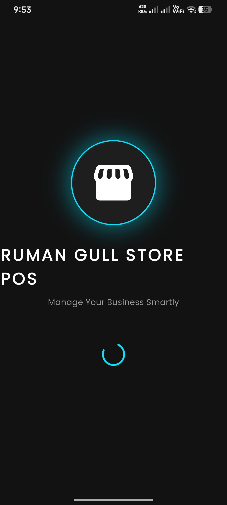 | 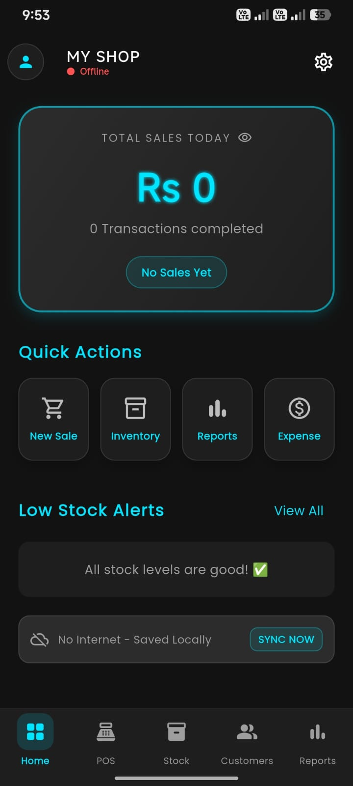 | 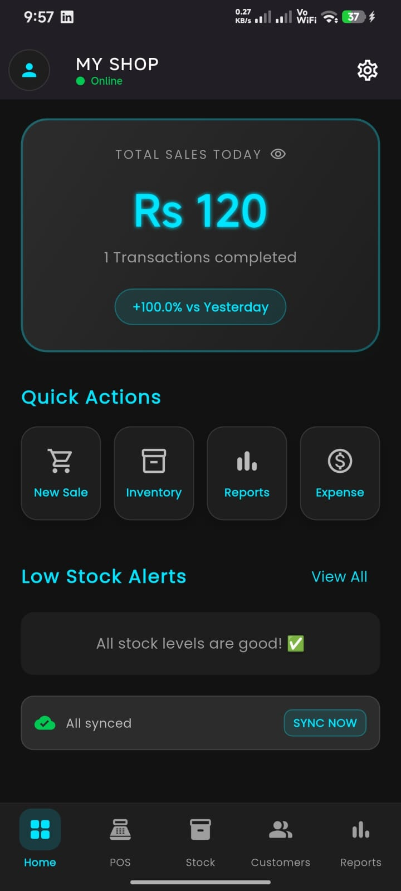 |

</div>

### 🛒 POS & Inventory

<div align="center">

| Add New Product | Inventory Management | Invoice / Receipt |
|:---:|:---:|:---:|
| 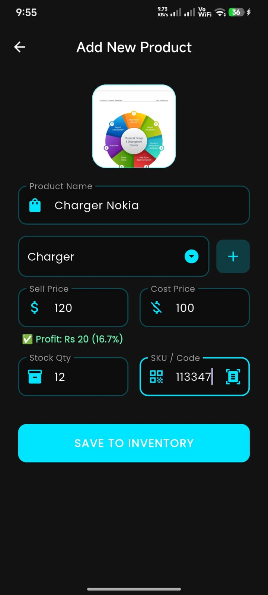 | 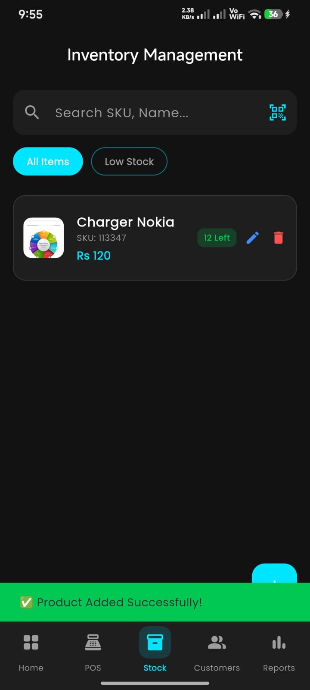 | 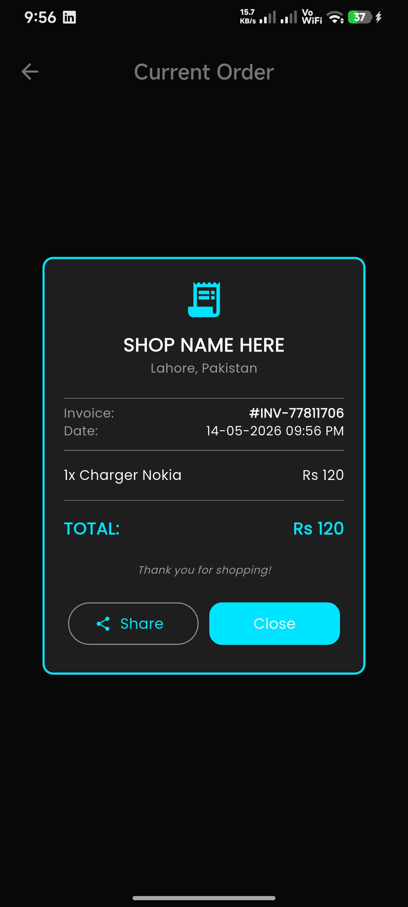 |

</div>

### 📊 Analytics & Customers

<div align="center">

| Business Analytics | Sales History | Customer Ledger |
|:---:|:---:|:---:|
| 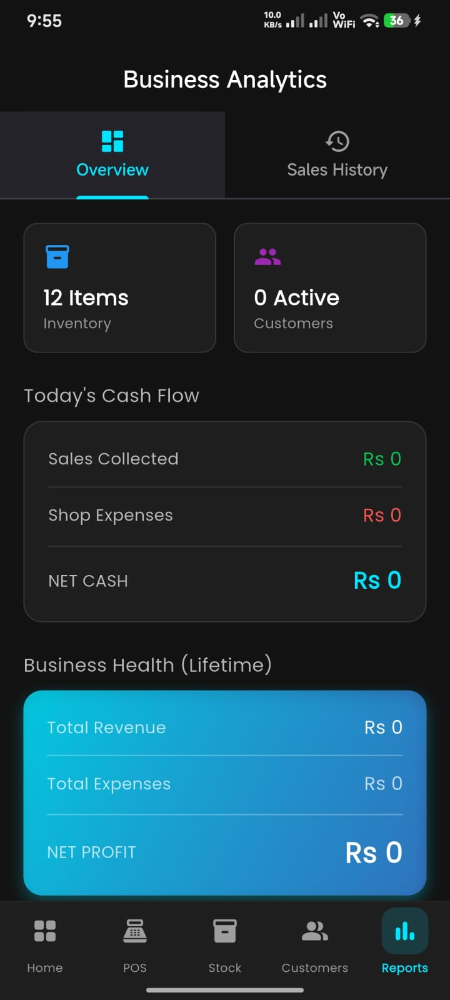 | 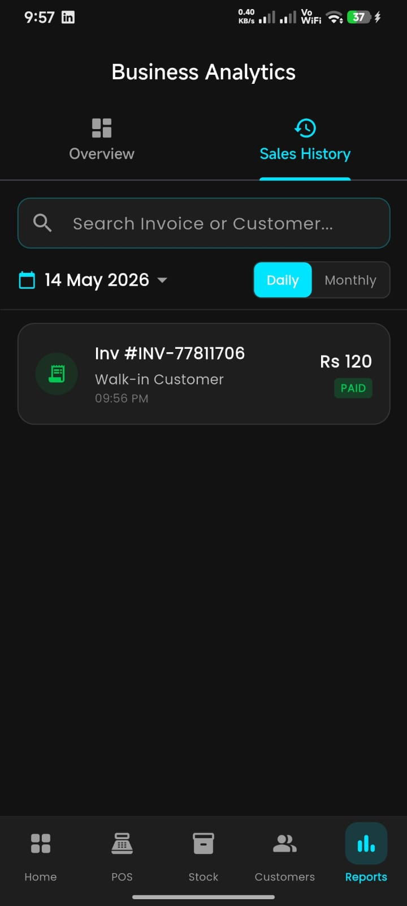 | 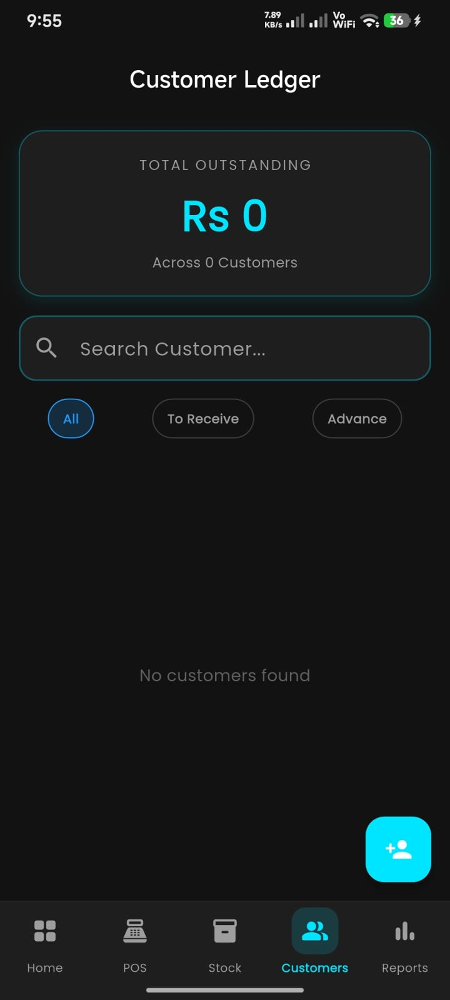 |

</div>

### ⚙️ Settings & Profile

<div align="center">

| Settings (General) | Settings (Data Mgmt) | My Profile |
|:---:|:---:|:---:|
| 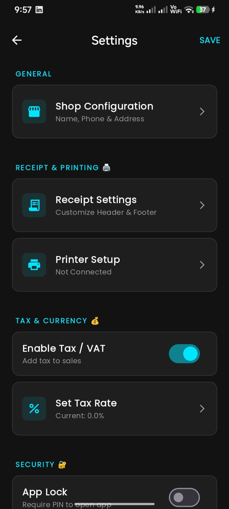 | 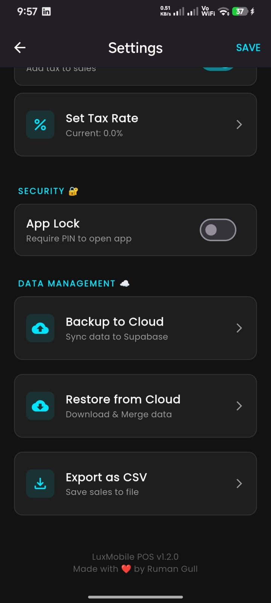 | 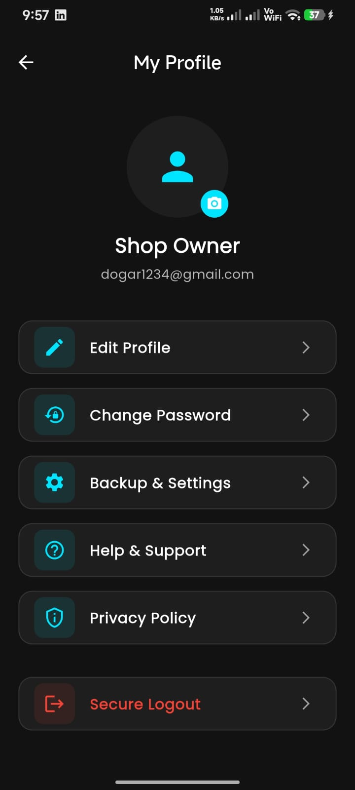 |

</div>

<div align="center">

| Edit Shop Details | Restore Data Prompt | Profile Updated |
|:---:|:---:|:---:|
| 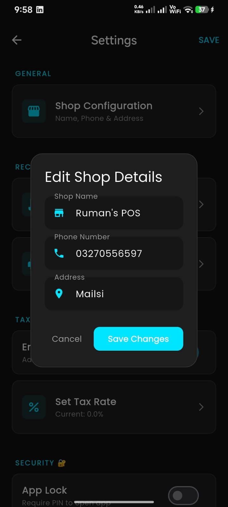 | 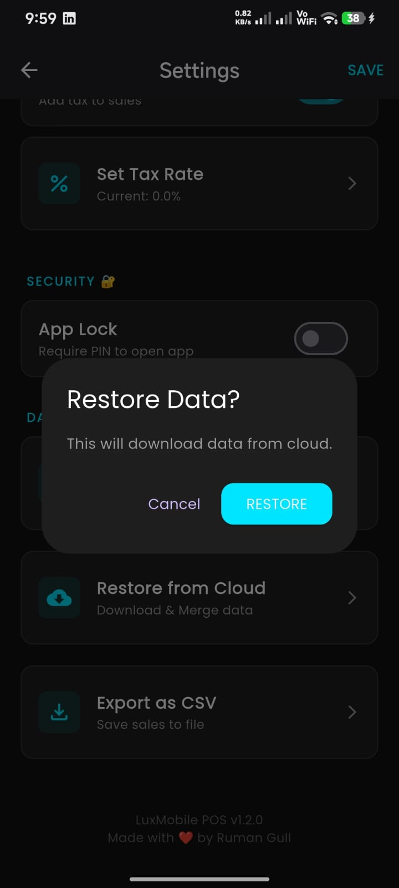 | 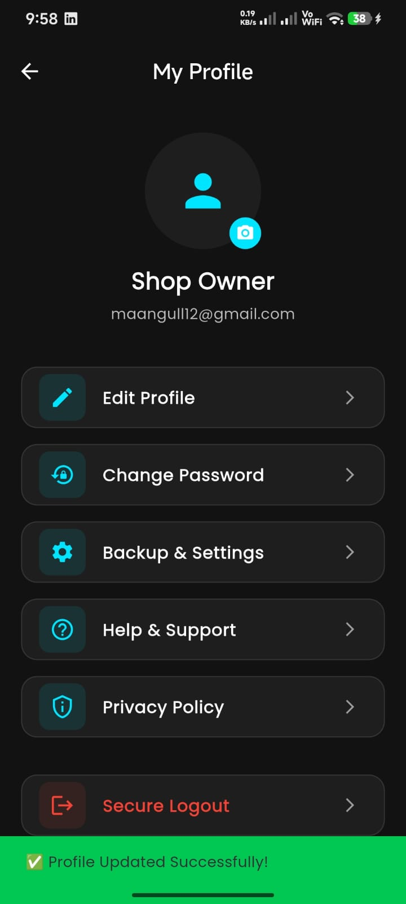 |

</div>

---

## 🛠️ Technology Stack

| Layer | Technology | Purpose |
|---|---|---|
| **UI Framework** | Flutter 3.0+ (Dart) | Cross-platform mobile application |
| **State Management** | Provider | Reactive, scalable state handling |
| **Local Database** | SQLite (`sqflite`) | Full offline data persistence |
| **Cloud Backend** | Supabase (PostgreSQL) | Cloud backup, sync, and auth |
| **Design System** | Material Design 3 | Custom dark theme with cyan accents |
| **Additional** | QR Scanner, CSV Export, Share Plus | Barcode scanning, data export, sharing |

---

## 📂 Project Architecture

The project follows a **Layered Architecture** pattern ensuring separation of concerns, testability, and scalability:

```
lib/
├── core/
│   ├── services/
│   │   ├── database_service.dart      # SQLite abstraction layer
│   │   ├── supabase_service.dart      # Supabase client & auth
│   │   └── sync_service.dart          # Offline-to-cloud sync engine
│   └── utils/
├── features/
│   ├── auth/                          # Login, registration, profile
│   ├── dashboard/                     # Home screen, quick actions
│   ├── pos/                           # Cart, billing, invoice generation
│   ├── inventory/                     # Product CRUD, stock management
│   ├── customers/                     # Ledger, transaction history
│   ├── reports/                       # Analytics, sales history
│   └── settings/                      # Shop config, tax, backup
├── models/                            # Data models (Product, Sale, Customer...)
└── widgets/                           # Shared reusable UI components
```

---

## ⚙️ How the Sync Algorithm Works

This is the central technical contribution of the project — a custom **Offline-First Synchronization Engine**:

```
┌─────────────────────────────────────────────────┐
│              OFFLINE OPERATION                  │
│  User action → SQLite write → isSynced = 0     │
└────────────────────┬────────────────────────────┘
                     │  (internet available)
                     ▼
┌─────────────────────────────────────────────────┐
│              SYNC PROCESS                       │
│  1. Fetch all rows WHERE isSynced = 0           │
│  2. UPSERT to Supabase (insert or update)       │
│  3. On success → update local isSynced = 1      │
└────────────────────┬────────────────────────────┘
                     │
                     ▼
┌─────────────────────────────────────────────────┐
│              RESTORE PROCESS                    │
│  Pull all data from Supabase                    │
│  Merge into SQLite with conflict resolution     │
│  (cloud wins on conflict — latest timestamp)    │
└─────────────────────────────────────────────────┘
```

**Key properties of this design:**
- No data loss regardless of connectivity state
- Sync is idempotent — running it twice produces the same result
- Works on new device installation via Restore from Cloud

---

## 🚀 Getting Started

### Prerequisites
- Flutter SDK 3.0+
- Android Studio / VS Code with Flutter plugin
- A Supabase account (free tier is sufficient)

### Installation

**1. Clone the repository**
```bash
git clone https://github.com/yourusername/ruman-store-pos.git
cd ruman-store-pos
```

**2. Install dependencies**
```bash
flutter pub get
```

**3. Configure Supabase**

Create a project on [supabase.com](https://supabase.com), then run the schema:
```bash
# Run the SQL schema in your Supabase SQL editor
cat sql/schema.sql
```

Then add your credentials in `lib/core/services/supabase_service.dart`:
```dart
const String supabaseUrl = 'YOUR_SUPABASE_URL';
const String supabaseAnonKey = 'YOUR_ANON_KEY';
```

**4. Run the app**
```bash
flutter run
```

---

## 🗃️ Database Schema (SQLite)

| Table | Key Fields |
|---|---|
| `products` | `id`, `name`, `category`, `sellPrice`, `costPrice`, `stockQty`, `sku`, `isSynced` |
| `sales` | `id`, `invoiceNumber`, `totalAmount`, `customerId`, `date`, `isSynced` |
| `sale_items` | `id`, `saleId`, `productId`, `quantity`, `unitPrice` |
| `customers` | `id`, `name`, `phone`, `balance`, `isSynced` |
| `expenses` | `id`, `description`, `amount`, `date`, `isSynced` |
| `settings` | `shopName`, `shopPhone`, `shopAddress`, `taxRate`, `taxEnabled` |

Every table carries an `isSynced` flag — the backbone of the offline-first sync strategy.

---

## 📦 Key Dependencies

```yaml
dependencies:
  flutter:
    sdk: flutter
  provider: ^6.x          # State management
  sqflite: ^2.x           # SQLite local database
  supabase_flutter: ^2.x  # Cloud backend
  path_provider: ^2.x     # File system access
  share_plus: ^7.x        # Invoice sharing
  mobile_scanner: ^3.x    # QR/Barcode scanning
  csv: ^5.x               # CSV export
  intl: ^0.18.x           # Date/number formatting
```

---

## ✅ Testing Checklist

- [x] Offline product addition and stock tracking
- [x] POS billing with automatic stock deduction
- [x] Invoice generation and sharing
- [x] Cloud sync when internet is restored
- [x] Restore from cloud on fresh device
- [x] Customer ledger balance tracking
- [x] Daily/Monthly sales reports
- [x] CSV data export
- [x] Settings persistence across sessions

---

<div align="center">

---

**Built with ❤️ by Ruman Gull**
*Software Engineering Student | Flutter & Full-Stack Developer*
*COMSATS University Islamabad, Vehari Campus*

</div>
