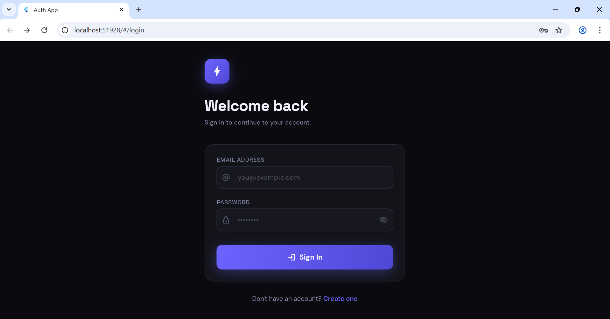
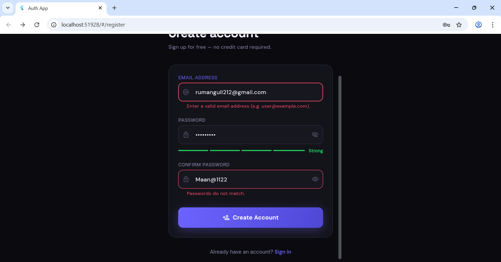
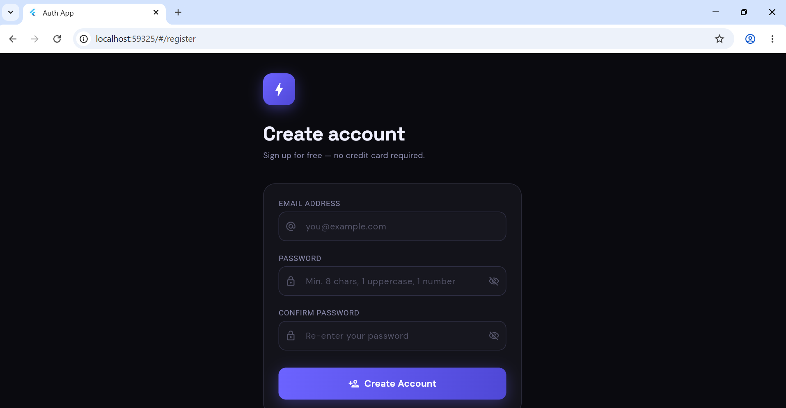
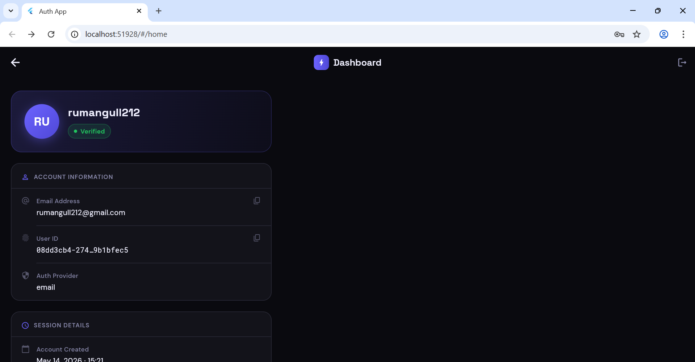
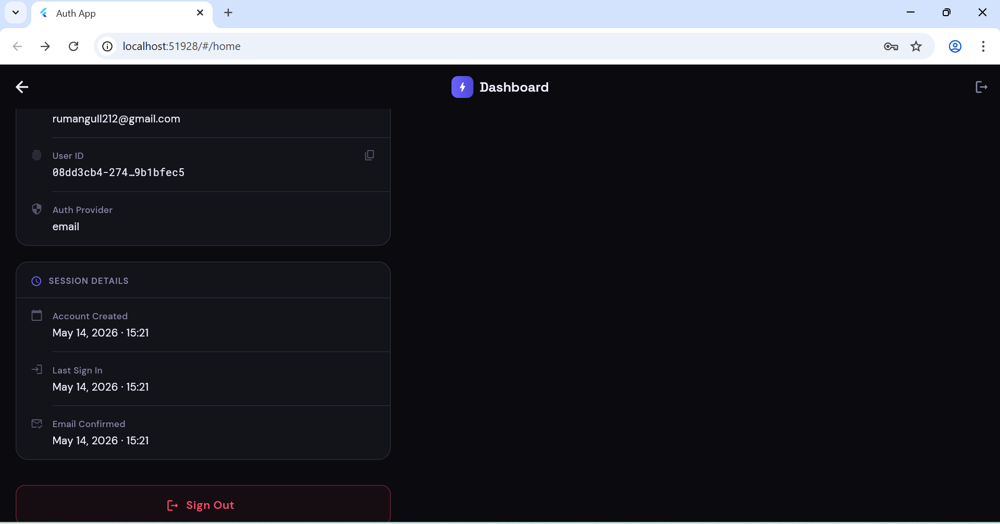
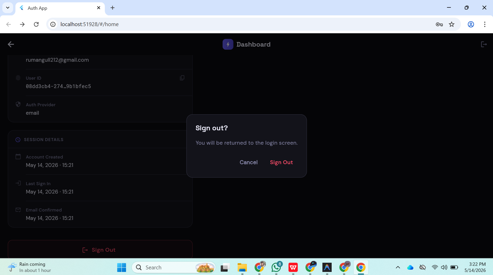
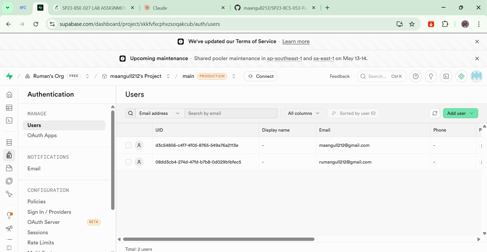
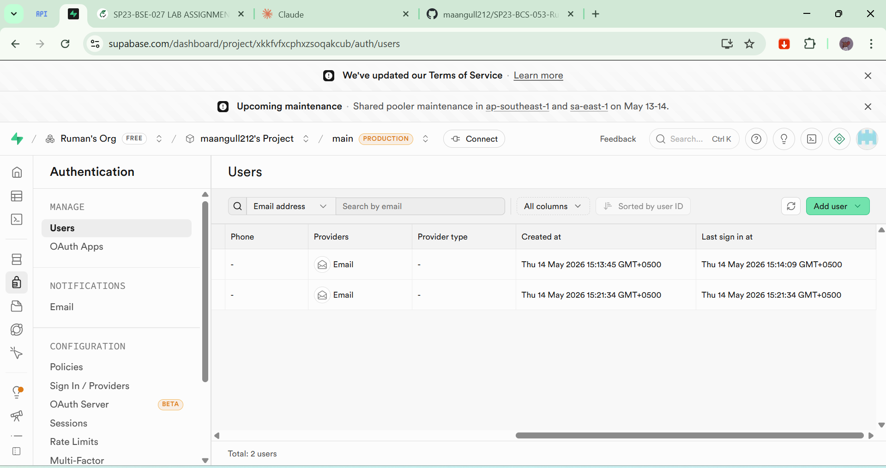

<div align="center">

# 🔐 Supabase Auth App
### Email-Based Registration & Login System

**Mobile Application Development Lab**
**Assignment — Supabase Authentication | CLO-3**

---


</div>

---

## 👨‍💻 Developer Info

| Field | Details |
|---|---|
| **Developer** | Ruman Gull |
| **Registration No.** | SP23-BCS-053 |
| **Course** | Mobile Application Development |
| **Institution** | COMSATS University Islamabad, Vehari Campus |

---

## 📱 Screenshots

> Add your screenshots inside the `screenshots/` folder and they will appear here automatically.

<div align="center">

| Register Screen | Validation Errors | Login Screen | Home Dashboard |
|---|---|---|---|
|  |  |  |  |

| Session Details | Sign Out Dialog | Supabase Users | Supabase Sessions |
|---|---|---|---|
|  |  |  |  |

</div>

---

## 📋 Overview

A fully functional **Flutter authentication application** built using **Supabase Email Authentication**. The app supports user registration, secure login, and a personalized home dashboard displaying real-time user data fetched directly from Supabase.

---

## ✨ Features

| Feature | Description |
|---------|-------------|
| 📝 Registration | Sign up with email, password & confirm password |
| 🔒 Secure Login | Email & password authentication via Supabase |
| 🏠 Home Dashboard | Displays User ID, email, provider & session info |
| ✅ Input Validation | Empty fields, invalid email, weak password, mismatch |
| 💬 Feedback Messages | Success & error SnackBars for every user action |
| 🔑 Password Strength | Live 4-level strength meter (Weak → Strong) |
| 👁️ Password Toggle | Show/hide password on all password fields |
| 🚪 Logout | Confirmation dialog before signing out |
| 🎨 Dark UI | Professional dark theme with violet-indigo accent |
| 📱 Responsive | Works on Android, iOS, and Web |

---

## 🔄 Authentication Flow

```
App Launch
    │
    ▼
SplashScreen — checks session
    │
    ├── Session active ──────────────► HomeScreen
    │                                      │
    └── No session ──► LoginScreen         │ Sign Out
                           │               │
                           │ "Create one" ◄┘
                           ▼
                     RegisterScreen
                           │
                           │ Success → navigate to Login
                           ▼
                     LoginScreen ──────────► HomeScreen
```

---

## 🏗️ Project Structure

```
lib/
├── config/
│   └── supabase_config.dart        ← Supabase URL & Anon Key
├── core/
│   ├── theme/
│   │   └── app_theme.dart          ← Colors, typography, input styles
│   ├── utils/
│   │   ├── validators.dart         ← All form validation logic
│   │   └── snackbar_helper.dart    ← Success / Error / Info messages
│   └── widgets/
│       ├── custom_text_field.dart  ← Reusable input field widget
│       └── primary_button.dart     ← Gradient button with loading state
├── features/
│   ├── auth/
│   │   ├── services/
│   │   │   └── auth_service.dart   ← Supabase register / login / logout
│   │   └── screens/
│   │       ├── login_screen.dart   ← Login form UI
│   │       └── register_screen.dart← Registration + password strength
│   ├── home/
│   │   └── screens/
│   │       └── home_screen.dart    ← User dashboard
│   └── splash/
│       └── splash_screen.dart      ← Auth gate (routes on session state)
└── main.dart                       ← App entry, Supabase init, routes
```

---

## ✔️ Validation Rules

| Field | Rule |
|-------|------|
| Email | Required · Must match valid email format |
| Password (Register) | Required · Min 8 chars · 1 uppercase · 1 number |
| Password (Login) | Required only |
| Confirm Password | Required · Must exactly match Password field |

---

## 🛠️ Tech Stack

| Technology | Purpose |
|-----------|---------|
| **Flutter 3.x** | Cross-platform UI framework |
| **Dart 3.x** | Programming language |
| **Supabase Flutter ^2.5.6** | Backend authentication (Email Auth) |
| **Google Fonts ^6.2.1** | DM Sans + Space Grotesk typography |

---

## ⚙️ Setup & Installation

### 1. Clone & Install
```bash
cd supabase_auth_app
flutter pub get
```

### 2. Configure Supabase
Open `lib/config/supabase_config.dart` and replace:
```dart
static const String supabaseUrl    = 'https://YOUR_ID.supabase.co';
static const String supabaseAnonKey = 'YOUR_ANON_KEY';
```

### 3. Run
```bash
flutter run
```

---

## 📦 Dependencies

```yaml
dependencies:
  flutter:
    sdk: flutter
  supabase_flutter: ^2.5.6
  google_fonts: ^6.2.1
  flutter_svg: ^2.0.10+1
```

---

<div align="center">

*Built with Flutter & Supabase — SP23-BCS-053*

</div>
