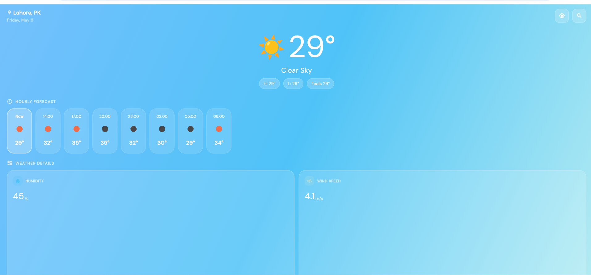
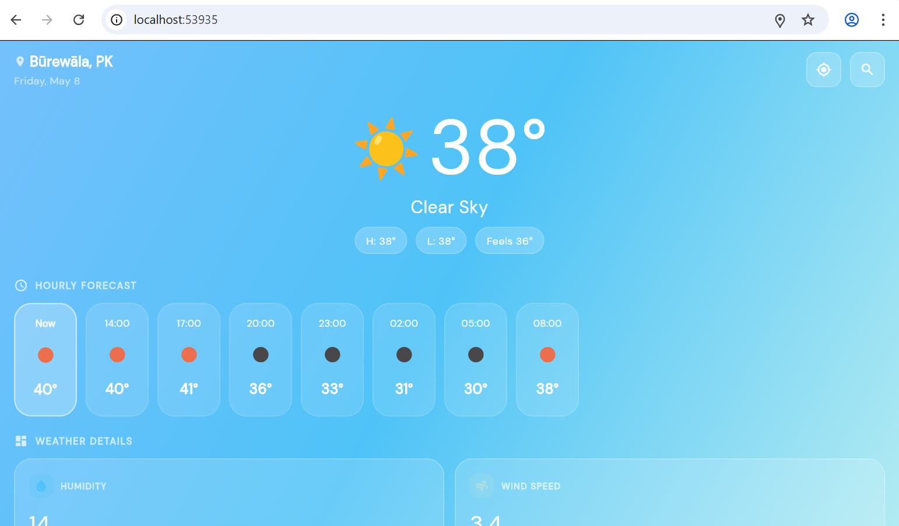
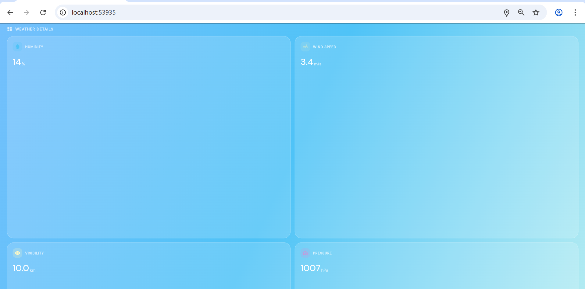
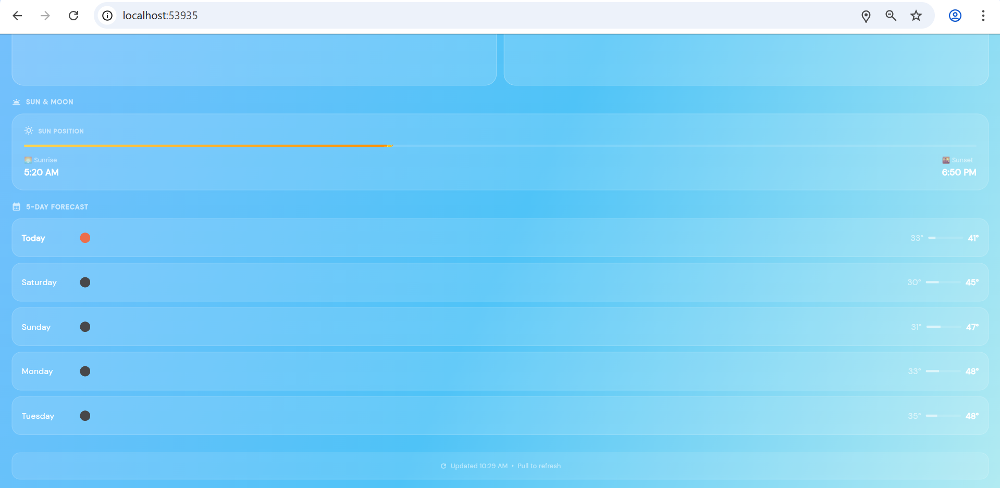

<div align="center">

# 🌤️ WeatherSense
### Real-Time Weather Application

**CSC303 — Mobile Application Development**
**Assignment No. 4 | CLO-3**

---


</div>

---

## 👨‍💻 Developer Info

| Field | Details |
|---|---|
| **Developer** | Ruman Gull |
| **Registration No.** | SP23-BCS-053 |
| **Course** | CSC303 — Mobile Application Development |
| **Assignment** | No. 4 (CLO-3) |
| **Institution** | COMSATS University Islamabad, Vehari Campus |

---

## 📱 Screenshots

> Add your screenshots inside the `screenshots/` folder and they will appear here automatically.

<div align="center">

| Home Screen | Search | Weather Details | Change City  |
|---|---|---|---|
|  |  |  |  |

</div>

> **How to add screenshots:**
> 1. Create a `screenshots/` folder in the root of the project.
> 2. Take at least 3 screenshots of the running app.
> 3. Name them `screenshot_1.png`, `screenshot_2.png`, `screenshot_3.png` and `screenshot_4.png`.
> 4. Push them to GitHub — they will appear in the table above automatically.

---

## 📖 About

**WeatherSense** is a fully functional, production-grade Flutter weather application that fetches real-time weather data from the [OpenWeatherMap API](https://openweathermap.org/). It features a clean, modern UI with dynamic theming that adapts to current weather conditions, GPS-based location detection, city search with history, hourly and 5-day forecasts, and robust error handling.

---

## ✨ Features

### Core Features (Assignment Requirements)
- ✅ Real-time weather data via OpenWeatherMap API
- ✅ City search with input field
- ✅ Displays temperature, weather condition, city name, and weather icons
- ✅ Full error handling (invalid city, no internet, bad API key)
- ✅ Clean and attractive UI
- ✅ Minimum 3 screenshots in `/screenshots` folder

### Extra Features (Beyond Requirements)
- 🌍 **Auto GPS Location** — detects your current location on launch
- 🕐 **Hourly Forecast** — next 24 hours in a horizontal scroll view
- 📅 **5-Day Forecast** — daily min/max temperature with visual bar
- 💧 **Weather Details Grid** — Humidity, Wind Speed, Visibility, Pressure
- 🌅 **Sunrise/Sunset Timeline** — animated sun position tracker
- 🎨 **Dynamic Gradient Themes** — UI color changes with weather (clear, rainy, cloudy, night)
- 🔍 **Recent Searches** — last 5 cities saved locally
- 🔄 **Pull to Refresh** — swipe down to update weather
- ⚡ **Smooth Animations** — staggered fade and slide via `flutter_animate`
- 📱 **Portrait Lock** — no broken landscape layouts
- 🌙 **Night Mode Detection** — automatically switches to night gradient after sunset

---

## 🏗️ Project Structure

```
weather_app/
├── lib/
│   ├── main.dart                   # App entry point
│   ├── models/
│   │   └── weather_model.dart      # Data models (current, hourly, daily)
│   ├── screens/
│   │   └── home_screen.dart        # Main weather screen
│   ├── services/
│   │   ├── weather_service.dart    # OpenWeatherMap API integration
│   │   └── location_service.dart   # GPS location using Geolocator
│   ├── theme/
│   │   └── app_theme.dart          # Color system, gradients, typography
│   └── widgets/
│       ├── weather_widgets.dart    # Reusable UI components
│       └── search_overlay.dart     # City search with recent history
├── android/
│   └── app/src/main/
│       └── AndroidManifest.xml     # Internet + Location permissions
├── screenshots/                    # App screenshots (minimum 3)
├── pubspec.yaml                    # Dependencies
└── README.md
```

---

## 🔧 Tech Stack

| Technology | Purpose |
|---|---|
| **Flutter 3.x** | Cross-platform mobile framework |
| **Dart 3.x** | Programming language |
| **OpenWeatherMap API** | Real-time weather & forecast data |
| **http** | API calls |
| **geolocator** | GPS device location |
| **geocoding** | Reverse geocoding support |
| **shared_preferences** | Persistent recent search history |
| **flutter_animate** | Smooth UI animations |
| **google_fonts** | DM Sans typography |
| **intl** | Date and time formatting |
| **connectivity_plus** | Network state detection |

---

## 🚀 Getting Started

### Prerequisites

- Flutter SDK `>=3.0.0`
- Dart SDK `>=3.0.0`
- An API key from [OpenWeatherMap](https://openweathermap.org/api) (free tier works)

### Installation

**1. Clone the repository**
```bash
git clone https://github.com/YOUR_USERNAME/weather_app.git
cd weather_app
```

**2. Add your API Key**

Open `lib/services/weather_service.dart` and replace the placeholder:
```dart
// Line 10
const String _apiKey = 'YOUR_API_KEY_HERE';
```
Replace `YOUR_API_KEY_HERE` with your actual OpenWeatherMap API key.

**3. Install dependencies**
```bash
flutter pub get
```

**4. Run the app**
```bash
flutter run
```

> **Note:** Run on a physical Android device or emulator for GPS to work correctly. Web (`flutter run -d chrome`) does not support device location.

---

## 🌐 API Reference

This app uses two OpenWeatherMap endpoints:

| Endpoint | Purpose |
|---|---|
| `/data/2.5/weather` | Current weather for a city or coordinates |
| `/data/2.5/forecast` | 5-day / 40-step 3-hourly forecast |

**Base URL:** `https://api.openweathermap.org/data/2.5/`

**Units:** Metric (°C, m/s)

**Free tier limit:** 60 calls/minute — well within this app's usage.

---

## ⚠️ Error Handling

The app handles all common failure scenarios gracefully:

| Error | Handling |
|---|---|
| No internet connection | Custom error screen with retry button |
| City not found (404) | "City not found" message |
| Invalid API key (401) | Clear message to check the API key |
| Server error (5xx) | "Service temporarily unavailable" |
| GPS permission denied | Falls back to default city (Lahore) |
| GPS timeout | Falls back to city search |

---

## 📦 Dependencies

```yaml
dependencies:
  flutter:
    sdk: flutter
  http: ^1.2.0
  geolocator: ^12.0.0
  geocoding: ^3.0.0
  shared_preferences: ^2.2.3
  intl: ^0.19.0
  flutter_animate: ^4.5.0
  connectivity_plus: ^6.0.3
  google_fonts: ^6.2.1
  cupertino_icons: ^1.0.8
```

---

## 📋 Submission Checklist

- [x] OpenWeatherMap API integrated
- [x] City search input field
- [x] Temperature, condition, city name, and icons displayed
- [x] Error handling implemented
- [x] Clean and attractive UI
- [x] `lib/` folder uploaded to GitHub
- [x] `pubspec.yaml` uploaded to GitHub
- [x] `screenshots/` folder with minimum 3 screenshots
- [x] Pushed to GitHub before deadline

---

<div align="center">

**Developed by Ruman Gull — SP23-BCS-053**

*COMSATS University Islamabad, Vehari Campus*

</div>
